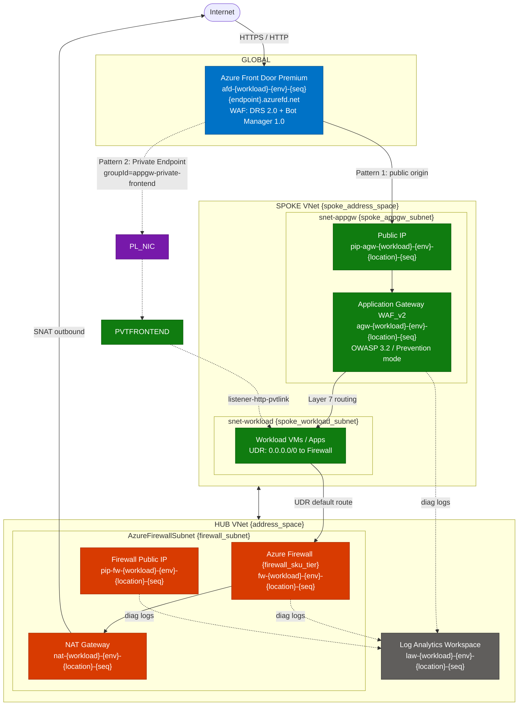

# Azure Firewall Hub-Spoke — AVM Terraform Deployment

Deploys a complete Azure hub-spoke network with Azure Firewall using [Azure Verified Modules (AVM)](https://azure.github.io/Azure-Verified-Modules/) following the **flat file-per-resource** pattern recommended by the AVM team (see [avm-terraform-labs](https://github.com/Azure-Samples/avm-terraform-labs)).

## Architecture



### Traffic Flows

| Flow | Path |
|------|------|
| Inbound internet → app | Front Door → AppGW WAF → workload |
| Spoke outbound internet | Workload → UDR → Firewall → NAT Gateway |
| Hub → Spoke | VNet Peering (allow forwarded traffic) |
| Spoke → Hub | VNet Peering (use hub firewall as gateway) |

## Project Structure

```
├── terraform.tf                        # Provider and version constraints
├── data.tf                             # Utility module (regions)
├── variables.tf                        # Input variables with templatestring naming
├── locals.tf                           # Naming computation + diagnostic settings
├── main.tf                             # Random string + resource group
├── outputs.tf                          # Grouped output maps
│
├── avm.log_analytics_workspace.tf      # Log Analytics Workspace
├── avm.virtual_network.tf              # Hub VNet + AzureFirewallSubnet
├── avm.spoke_virtual_network.tf        # Spoke VNet + subnets + peering
├── avm.public_ip_address.tf            # Firewall public IP
├── avm.nat_gateway.tf                  # NAT Gateway for outbound SNAT
├── avm.firewall_policy.tf              # Firewall Policy
├── avm.firewall.tf                     # Azure Firewall
├── avm.application_gateway.tf          # Application Gateway WAF_v2 (spoke)
├── avm.front_door.tf                   # Azure Front Door Premium (global) + WAF policy + Private Link origin
│
├── firewall_rules.tf                   # Firewall rule collection groups
├── spoke_route_table.tf                # UDR — route spoke traffic via firewall
│
├── terraform.tfvars.example            # Example variable values
└── README.md
```

## AVM Module Versions

| Module | Source | Version |
|--------|--------|---------|
| Resource Group | `Azure/avm-res-resources-resourcegroup/azurerm` | 0.2.1 |
| Log Analytics Workspace | `Azure/avm-res-operationalinsights-workspace/azurerm` | 0.4.2 |
| Virtual Network | `Azure/avm-res-network-virtualnetwork/azurerm` | 0.16.0 |
| Public IP Address | `Azure/avm-res-network-publicipaddress/azurerm` | 0.2.0 |
| NAT Gateway | `Azure/avm-res-network-natgateway/azurerm` | 0.3.2 |
| Firewall Policy | `Azure/avm-res-network-firewallpolicy/azurerm` | 0.3.4 |
| Azure Firewall | `Azure/avm-res-network-azurefirewall/azurerm` | 0.4.0 |
| Application Gateway | `Azure/avm-res-network-applicationgateway/azurerm` | 0.5.2 |
| Front Door (CDN Profile) | `Azure/avm-res-cdn-profile/azurerm` | 0.1.9 |
| Regions Utility | `Azure/avm-utl-regions/azurerm` | 0.5.0 |

## Naming Convention

Resource names are generated using Terraform's `templatestring()` function:

| Template Segment | Default | Example output |
|-----------------|---------|----------------|
| `workload` | `fw` | `fw` |
| `environment` | `dev` | `dev` |
| `location` | _(from `var.location`)_ | `eastus` |
| `sequence` | `001` | `001` |

Example generated names:

| Resource | Name |
|----------|------|
| Resource Group | `rg-fw-dev-eastus-001` |
| Hub VNet | `vnet-fw-dev-eastus-001` |
| Spoke VNet | `vnet-spoke-fw-dev-eastus-001` |
| Azure Firewall | `fw-fw-dev-eastus-001` |
| Application Gateway | `agw-fw-dev-eastus-001` |
| AppGW Private Link config | `pvtlink-fw-dev-001` |
| Front Door | `afd-fw-dev-001` |
| Route Table | `rt-spoke-fw-dev-eastus-001` |
| Log Analytics | `law-fw-dev-eastus-001` |

Override any name template via the `resource_name_templates` variable.

## Prerequisites

- Azure subscription with Contributor (or scoped) permissions
- Terraform `~> 1.10` installed
- Azure CLI installed and authenticated:

  ```bash
  az login
  export ARM_SUBSCRIPTION_ID=<your-subscription-id>
  # Windows:
  $env:ARM_SUBSCRIPTION_ID = "<your-subscription-id>"
  ```

## Quick Start

```bash
# 1. Clone / copy the configuration
cp terraform.tfvars.example terraform.tfvars

# 2. Edit terraform.tfvars with your subscription details
#    At minimum, set: location

# 3. Initialize providers and modules
terraform init

# 4. Review the deployment plan
terraform plan

# 5. Deploy (expect 15-30 minutes for Firewall + Application Gateway + Front Door)
terraform apply

# 6. View resource IDs and key outputs
terraform output
```

## Configuration Reference

### Key Variables

| Variable | Description | Default |
|----------|-------------|---------|
| `location` | Azure region | _(required)_ |
| `resource_name_workload` | Naming workload segment | `fw` |
| `resource_name_environment` | Naming environment segment | `dev` |
| `address_space` | Hub VNet CIDR | `10.0.0.0/16` |
| `firewall_subnet_address_prefix` | Firewall subnet (min /26) | `10.0.1.0/26` |
| `spoke_address_space` | Spoke VNet CIDR | `10.1.0.0/16` |
| `spoke_workload_subnet_address_prefix` | Workload subnet | `10.1.1.0/24` |
| `spoke_appgw_subnet_address_prefix` | AppGW subnet (min /26) | `10.1.2.0/24` |
| `firewall_sku_tier` | Firewall tier: Basic/Standard/Premium | `Standard` |
| `appgw_capacity` | AppGW capacity units | `2` |
| `availability_zones` | Zones for FW, PIP, AppGW | `["1","2","3"]` |
| `tags` | Tags applied to all resources | _(see example)_ |
| `enable_appgw_private_link` | Enable Pattern 2: AFD → AppGW via Private Link | `false` |
| `appgw_private_link_subnet_prefix` | Dedicated /29 Private Link subnet CIDR | `10.1.3.0/29` |
| `appgw_private_frontend_ip` | Static private IP for AppGW private frontend configuration | `10.1.2.200` |
### Firewall Rules

Firewall rules are configured via three variables:

```hcl
# Network rules (Layer 4)
network_rule_collections = {
  allow-dns = {
    priority = 1000
    action   = "Allow"
    rules = [{
      name                  = "allow-dns"
      protocols             = ["UDP"]
      source_addresses      = ["10.0.0.0/8"]
      destination_addresses = ["*"]
      destination_ports     = ["53"]
    }]
  }
}

# Application rules (Layer 7 FQDN)
application_rule_collections = {
  allow-web = {
    priority = 1000
    action   = "Allow"
    rules = [{
      name              = "allow-microsoft"
      source_addresses  = ["10.0.0.0/8"]
      destination_fqdns = ["*.microsoft.com", "*.azure.com"]
      protocols         = [{ type = "Https", port = 443 }]
    }]
  }
}

# DNAT rules (inbound NAT through firewall public IP)
dnat_rule_collections = {
  inbound-rdp = {
    priority = 1000
    rules = [{
      name                = "rdp-to-vm"
      protocols           = ["TCP"]
      source_addresses    = ["<your-ip>/32"]
      destination_address = "<firewall-public-ip>"
      destination_ports   = ["3389"]
      translated_address  = "10.1.1.4"
      translated_port     = "3389"
    }]
  }
}
```

## Deployment Notes

### Expected Deployment Times

| Resource | Typical Time |
|----------|-------------|
| Resource Group, VNets, Subnets | < 2 min |
| Public IPs, NAT Gateway | 1-3 min |
| Log Analytics Workspace | 2-4 min |
| Azure Firewall | 6-12 min |
| Application Gateway (WAF_v2) | 6-10 min |
| VNet Peerings, Route Table | < 1 min |
| Azure Front Door Standard | 1-2 min _(45s profile + child resources)_ |

> **Total: ~20-30 minutes** for a fresh deployment.

### Known Issue — Front Door First-Deployment Timeout

On rare occasions (cold Azure region), the `azapi_resource.front_door_profile` creation
can take 25-30 minutes and hit Terraform's internal HTTP deadline, returning
`context deadline exceeded`. **The resource is still created successfully in Azure.**

**Verified workaround** (used to validate this deployment):

```bash
# Step 1: Run a targeted apply so Terraform discovers/imports the already-created profile:
terraform apply -auto-approve \
  -target='module.front_door.azapi_resource.front_door_profile' \
  -target='module.front_door.azurerm_cdn_frontdoor_endpoint.endpoints["ep1"]' \
  -target='module.front_door.azurerm_cdn_frontdoor_origin_group.origin_groups["appgw"]' \
  -target='module.front_door.modtm_telemetry.telemetry[0]'

# Step 2: Run full apply to converge remaining outputs.
terraform apply -auto-approve
```

### Known Issue — AVM Front Door Module `for_each` Error During `terraform import`

The AVM `cdn-profile` module v0.1.9 has a `for_each` on `azurerm_cdn_frontdoor_custom_domain_association`
that produces an `Invalid for_each argument` error when running `terraform import`. This fails the
post-import plan validation and **prevents the state from being saved**.

**Workaround:** If a resource gets created in Azure but not in Terraform state (e.g. due to a
transient network error during apply), delete it from Azure and let Terraform recreate it via
a `-target` apply rather than using `terraform import`.

```bash
# Example: delete an orphaned AFD origin then recreate it:
az rest --method delete --uri "https://management.azure.com/<origin-id>?api-version=2024-02-01"
terraform apply -auto-approve -var="enable_appgw_private_link=true" \
  -target='azapi_resource.appgw_private_origin[0]' \
  -target='azurerm_cdn_frontdoor_route.private_link[0]' \
  -target='azurerm_cdn_frontdoor_security_policy.waf' \
  -target='terraform_data.approve_afd_pvtlink[0]'
```

### Application Gateway — WAF Mode

The Application Gateway WAF policy uses an external `azurerm_web_application_firewall_policy` resource in **Prevention mode** (OWASP 3.2) with a `GeoBlockRussia` custom rule. This is the recommended production configuration.

To temporarily switch to Detection mode for baseline review, edit `avm.application_gateway.tf`:

```hcl
# In the azurerm_web_application_firewall_policy resource:
policy_settings {
  enabled                     = true
  mode                        = "Detection"   # Change from "Prevention"
  request_body_check          = true
  file_upload_limit_in_mb     = 100
  max_request_body_size_in_kb = 128
}
```

### Front Door Origin Connectivity Patterns

Two patterns are available for connecting Front Door Premium to Application Gateway. The active pattern is selected via `enable_appgw_private_link`.

#### Pattern 1 — Public AppGW origin (default: `enable_appgw_private_link = false`)

```
Internet → Front Door PoP → Public IP of AppGW → AppGW listener → backend
```

- AppGW has a public IP; NSG on `snet-appgw` should allow inbound 80/443 from `AzureFrontDoor.Backend` service tag only
- AppGW WAF custom rule validates `X-Azure-FDID` header to reject traffic not originating from your Front Door profile

#### Pattern 2 — Private Link (most secure: `enable_appgw_private_link = true`)

```
Internet → Front Door PoP → Front Door managed Private Endpoint
         → AppGW Private Link NIC (snet-pvtlink-appgw, pvtlink-fw-dev-001)
         → AppGW private frontend IP (10.1.2.200, appgw-private-frontend)
         → listener-http-pvtlink → backend-workload pool
```

What happens when you flip the flag:

| Resource | Change |
|----------|--------|
| Spoke VNet | New `snet-pvtlink-appgw` /29 subnet added (`privateLinkServiceNetworkPolicies = Disabled`) |
| AppGW | `private_link_configuration` block (`pvtlink-fw-dev-001`) + static private frontend IP `appgw-private-frontend` (10.1.2.200) + second HTTP listener `listener-http-pvtlink` + routing rule |
| Front Door | Module-managed public origin replaced by `azapi_resource.appgw_private_origin` using `groupId = "appgw-private-frontend"` |
| Front Door route | Module-managed `route-default` replaced by `azurerm_cdn_frontdoor_route.private_link` referencing the private origin |

> **Why `azapi_resource` instead of `azurerm_cdn_frontdoor_origin`?**  
> Application Gateway's private link resource exposes `groupId = "appgw-private-frontend"` (the frontend IP configuration name). The `azurerm_cdn_frontdoor_origin` provider always sends `groupId = "Gateway"`, which Azure's AppGW private link API rejects with `ApplicationGatewayPrivateLinkOperationError`. Using `azapi_resource` lets us set the exact `groupId` value that the AppGW expects.
>
> You can verify your AppGW's valid groupId with:  
> `az network private-link-resource list --name <appgw-name> -g <rg> --type Microsoft.Network/applicationGateways`

**The private endpoint connection is auto-approved** by a `terraform_data` provisioner that runs immediately after the Front Door origin is created. It polls the AppGW for any pending Private Endpoint connections (up to 5 minutes) and approves them via Azure CLI.

Requirements for auto-approval:
- Azure CLI installed and authenticated (`az login`) in the same subscription context as Terraform
- The identity running Terraform must have **Contributor** or **Network Contributor** on the resource group

If auto-approval fails (e.g. CLI not available), approve manually:

```bash
# Option A — Portal:
# Application Gateway → Settings → Private Link → Private endpoint connections → Approve

# Option B — CLI:
az network private-endpoint-connection approve \
  --name <connection-name> \
  --resource-group rg-fw-dev-eastus-001 \
  --type Microsoft.Network/applicationGateways \
  --service-name agw-fw-dev-eastus-001
```

Once approved, Front Door routes traffic privately; the AppGW public IP is no longer used by Front Door (you may add an NSG deny-Internet rule to `snet-appgw` to enforce the lockdown).

> **Constraint**: Private origins cannot share an origin group with public origins in the same Front Door profile.  
> **Name limit**: AppGW name + Private Link config name must be ≤ 70 characters combined.  
> **groupId must match**: Use `az network private-link-resource list` to discover the correct `groupId` for your AppGW — it equals the private frontend IP configuration name (e.g. `appgw-private-frontend`), not a fixed string like `"Gateway"`.

### Front Door SKU & WAF Compatibility

> **WAF managed rule sets require `Premium_AzureFrontDoor`.** Standard SKU only supports custom rules — it does not support the Microsoft Default Rule Set (DRS) or Bot Manager.

| Feature | Standard_AzureFrontDoor | Premium_AzureFrontDoor |
|---------|------------------------|------------------------|
| Custom WAF rules | ✅ | ✅ |
| Managed rule sets (DRS 2.0) | ❌ | ✅ |
| Bot Manager 1.0 | ❌ | ✅ |
| Security policy / WAF association | ❌ | ✅ |
| Private Link origins | ❌ | ✅ |
| Estimated additional cost | — | ~$330/month base + per-rule fees |

**This deployment uses `Premium_AzureFrontDoor`** with:
- `DefaultRuleSet 1.0` (OWASP core rules) — action: `Block`
- `Microsoft_BotManagerRuleSet 1.0` (bot protection) — action: `Block`
- Custom rule `GeoBlockRussia` — blocks all traffic from `RU` (priority 100, evaluated before managed rules)
- Mode: `Prevention` (active blocking; change to `Detection` for initial rollout)

**Application Gateway WAF** (external `azurerm_web_application_firewall_policy`) is also configured with:
- `OWASP 3.2` managed rule set — mode: `Prevention`
- Custom rule `GeoBlockRussia` — blocks `RU` at the AppGW layer (defence-in-depth)

To add or remove geo-blocked countries, edit the `match_values` list in `avm.front_door.tf`:

```hcl
match_condition {
  match_variable = "SocketAddr"
  operator       = "GeoMatch"
  match_values   = ["RU", "CN", "KP"]  # ISO 3166-1 alpha-2 codes
}
```

> **SKU lock-in**: Azure does not allow in-place SKU upgrades for Front Door profiles. Changing between Standard and Premium requires destroying and recreating the profile (and all child resources: endpoints, origins, routes, security policies). Plan for ~5 minutes of downtime.

To switch to Detection mode for initial rollout, edit `avm.front_door.tf`:

```hcl
resource "azurerm_cdn_frontdoor_firewall_policy" "waf" {
  mode = "Detection"   # Change to "Prevention" once baselines are reviewed
  ...
}
```

### Spoke Subnet Routing Note

The `snet-appgw` subnet intentionally has **no UDR**. Application Gateway v2 uses
management ports 65200-65535 which must not be routed through a virtual appliance.
Only `snet-workload` has the UDR forcing egress through the firewall.

## Outputs

After deployment, `terraform output` shows:

```bash
firewall_private_ip = "10.0.1.4"

resource_names = {
  firewall_name                = "fw-fw-dev-eastus-001"
  spoke_virtual_network_name   = "vnet-spoke-fw-dev-eastus-001"
  appgw_name                   = "agw-fw-dev-eastus-001"
  appgw_pvtlink_config_name    = "pvtlink-fw-dev-001"    # Private Link config name on AppGW
  front_door_name              = "afd-fw-dev-001"
  ...
}

resource_ids = {
  resource_group        = "/subscriptions/.../resourceGroups/rg-fw-dev-eastus-001"
  firewall              = ".../azureFirewalls/fw-fw-dev-eastus-001"
  application_gateway   = ".../applicationGateways/agw-fw-dev-eastus-001"
  front_door            = ".../profiles/afd-fw-dev-001"
  spoke_workload_subnet = ".../subnets/snet-workload"
  spoke_appgw_subnet    = ".../subnets/snet-appgw"
  ...
}
```

## Post-Deployment Steps

1. **Add backend VMs/apps** to the Application Gateway backend pool (`backend-workload`)
2. **Enable WAF Prevention mode** once you've validated no false positives
3. **Review firewall rules** — update source_addresses to include spoke CIDR `10.1.0.0/16`
4. **Configure custom domain** on Front Door endpoint (optional)
5. **Check diagnostics** in the Log Analytics workspace (`law-fw-dev-eastus-001`)

### Useful KQL queries

```kql
// Firewall application rule hits
AzureDiagnostics
| where ResourceType == "AZUREFIREWALLS"
| where Category == "AzureFirewallApplicationRule"
| project TimeGenerated, msg_s
| order by TimeGenerated desc

// Application Gateway WAF blocks (after switching to Prevention mode)
AzureDiagnostics
| where ResourceType == "APPLICATIONGATEWAYS"
| where Category == "ApplicationGatewayFirewallLog"
| where action_s == "Blocked"
| project TimeGenerated, hostname_s, requestUri_s, ruleId_s
```

## Cleanup

```bash
terraform destroy -auto-approve
# Note: First attempt may fail on Firewall with 409 (concurrent operation).
# Run again if that happens — it will complete on the second attempt.
```

## Best Practices Implemented

| Practice | Implementation |
|----------|---------------|
| CAF Naming | `templatestring()` with workload/env/location/sequence segments |
| Zone Redundancy | Firewall, Public IPs, AppGW all deployed across zones 1-2-3 |
| Centralized Diagnostics | All resources send logs to shared Log Analytics workspace |
| WAF — Edge (Front Door) | Front Door Premium + WAF policy: DRS 1.0 + Bot Manager 1.0 + geo-block custom rule, Prevention mode |
| WAF — Regional (AppGW) | Application Gateway WAF_v2 with OWASP 3.2 + geo-block Russia custom rule, Prevention mode |
| Private Ingress (opt-in) | `enable_appgw_private_link = true` — Front Door → AppGW via managed Private Endpoint, no public traffic reaches AppGW |
| UDR | Spoke traffic force-tunneled through firewall |
| NAT Gateway | Deterministic outbound SNAT from hub subnet |
| Peering | Bidirectional hub-spoke peering with `create_reverse_peering` |
| Firewall Policy | Separate policy resource (reusable across multiple firewalls) |
| AVM Modules | All resources use Azure Verified Modules for compliance |

## Security Considerations

- Front Door WAF is in **Prevention mode** — review DRS 2.0 false positives in Log Analytics before applying to production traffic
- Switch AppGW WAF from Detection → Prevention before going live
- Update firewall rules to include spoke CIDR `10.1.0.0/16` in `source_addresses`
- `Premium_AzureFrontDoor` SKU is required for managed WAF rules — do not downgrade to Standard without removing the WAF policy and security policy resources first
- Enable Firewall Premium SKU for IDPS and TLS inspection in production
- Do not place a UDR on `snet-appgw` (breaks AppGW management traffic)
- Use Azure Policy to enforce allowed SKUs and regions

## Troubleshooting

| Error | Cause | Fix |
|-------|-------|-----|
| `context deadline exceeded` on Front Door | Azure CDN provisioning > 30 min | Re-run `terraform apply` |
| `409 Conflict` on Firewall destroy | Concurrent operation in progress | Re-run `terraform destroy` |
| `AnotherOperationInProgress` on delete | Previous operation still running | Wait 2-3 minutes and retry |
| Firewall subnet too small | Must be /26 or larger | Use `/26` minimum for `firewall_subnet_address_prefix` |
| `WAF policy SKU does not match profile SKU` | WAF policy must use `Premium_AzureFrontDoor` | Ensure `sku_name = "Premium_AzureFrontDoor"` in `azurerm_cdn_frontdoor_firewall_policy` |
| Cannot downgrade Front Door SKU | In-place SKU change not supported | Run `terraform destroy` + `terraform apply` to recreate with new SKU |
| Managed rule set not available on Standard | Standard SKU lacks DRS / Bot Manager | Upgrade to Premium or switch WAF to custom rules only |
| AppGW unhealthy backend | No VMs in backend pool | Add VMs or use a health endpoint |
| Private Link origin pending / unhealthy | Private Endpoint awaiting approval | Auto-approval runs as part of `terraform apply`; if it fails, approve via Portal or CLI |
| `az` CLI not found during apply | CLI not installed or not on PATH | Install Azure CLI or approve the private endpoint manually |
| `name too long` on Private Link config | AppGW name + PL config name > 70 chars | Shorten `appgw_pvtlink_config_name` template in `resource_name_templates` |
| Cannot mix public + private origins | Front Door enforces same-type origin groups | Use separate origin groups for public vs. private origins |

## References

- [Azure Verified Modules](https://azure.github.io/Azure-Verified-Modules/)
- [AVM Terraform Labs Reference](https://github.com/Azure-Samples/avm-terraform-labs)
- [Azure Firewall Documentation](https://learn.microsoft.com/azure/firewall/)
- [Application Gateway WAF](https://learn.microsoft.com/azure/web-application-firewall/ag/ag-overview)
- [Azure Front Door](https://learn.microsoft.com/azure/frontdoor/)
- [Hub-Spoke Network Topology](https://learn.microsoft.com/azure/architecture/reference-architectures/hybrid-networking/hub-spoke)


Deploys an Azure Firewall environment using [Azure Verified Modules (AVM)](https://azure.github.io/Azure-Verified-Modules/) following the **flat file-per-resource** pattern recommended by the AVM team (see [avm-terraform-labs](https://github.com/Azure-Samples/avm-terraform-labs)).

## Architecture

- **Resource Group** — AVM resource group module
- **Log Analytics Workspace** — centralized diagnostics destination
- **Virtual Network** — AVM VNet with dedicated `AzureFirewallSubnet`
- **Public IP** — Standard SKU, zone-redundant
- **Firewall Policy** — manages rule collections
- **Azure Firewall** — Standard/Premium tier with diagnostics enabled

## Project Structure

```
├── terraform.tf                        # Provider and version constraints
├── data.tf                             # Utility modules (regions)
├── variables.tf                        # Input variables with templatestring naming
├── locals.tf                           # Naming computation and diagnostic settings
├── main.tf                             # Random string and resource group
├── avm.log_analytics_workspace.tf      # Log Analytics Workspace AVM module
├── avm.virtual_network.tf              # Virtual Network AVM module
├── avm.public_ip_address.tf            # Public IP AVM module
├── avm.firewall_policy.tf              # Firewall Policy AVM module
├── avm.firewall.tf                     # Azure Firewall AVM module
├── outputs.tf                          # Grouped output maps
├── terraform.tfvars.example            # Example variable values
└── README.md
```

## Naming Convention

Resource names are generated using Terraform's `templatestring()` function with configurable segments:

| Segment       | Default | Description                        |
|---------------|---------|------------------------------------|
| `workload`    | `fw`    | Short workload identifier          |
| `environment` | `dev`   | Environment (dev, tst, prd, etc.)  |
| `location`    | —       | Azure region (from `var.location`) |
| `sequence`    | `001`   | Sequence number (zero-padded)      |

Override any name template via the `resource_name_templates` variable.

## Prerequisites

- Azure subscription with appropriate permissions
- Terraform ~> 1.10 installed
- Azure CLI (optional, for authentication)

## Module Sources

| Module | Version |
|--------|---------|
| [Resource Group](https://registry.terraform.io/modules/Azure/avm-res-resources-resourcegroup/azurerm/latest) | 0.2.1 |
| [Log Analytics Workspace](https://registry.terraform.io/modules/Azure/avm-res-operationalinsights-workspace/azurerm/latest) | 0.4.2 |
| [Virtual Network](https://registry.terraform.io/modules/Azure/avm-res-network-virtualnetwork/azurerm/latest) | 0.16.0 |
| [Public IP Address](https://registry.terraform.io/modules/Azure/avm-res-network-publicipaddress/azurerm/latest) | 0.2.0 |
| [Firewall Policy](https://registry.terraform.io/modules/Azure/avm-res-network-firewallpolicy/azurerm/latest) | 0.2.3 |
| [Azure Firewall](https://registry.terraform.io/modules/Azure/avm-res-network-azurefirewall/azurerm/latest) | 0.4.0 |
| [Regions Utility](https://registry.terraform.io/modules/Azure/avm-utl-regions/azurerm/latest) | 0.5.0 |

## Quick Start

```bash
cp terraform.tfvars.example terraform.tfvars
# Edit terraform.tfvars with your values

terraform init
terraform plan
terraform apply
```

7. **View outputs**

   ```bash
   terraform output
   ```

## Configuration

### Required Variables

All variables have sensible defaults. The following are commonly customized:

| Variable | Description | Default |
|----------|-------------|---------|
| `location` | Azure region for deployment | `East US` |
| `firewall_sku_tier` | Firewall tier: Basic, Standard, or Premium | `Standard` |
| `vnet_address_space` | Virtual network address space | `["10.0.0.0/16"]` |
| `firewall_subnet_address_prefix` | Firewall subnet (min /26) | `["10.0.1.0/26"]` |

### Optional Customizations

- **Resource Names**: Set custom names or use auto-generated CAF-compliant names
- **Availability Zones**: Configure zone redundancy (default: zones 1, 2, 3)
- **Log Retention**: Adjust Log Analytics retention (30-730 days)
- **SNAT Ranges**: Configure private IP ranges for SNAT
- **Tags**: Apply organizational tags to all resources

See `variables.tf` for all available configuration options.

## Best Practices Implemented

✅ **Naming Conventions**: Uses Azure Naming module for CAF-compliant resource names  
✅ **Security**: Standard SKU public IP, zone-redundancy, firewall policy separation  
✅ **Monitoring**: Integrated Log Analytics with diagnostic settings  
✅ **Modularity**: Uses Azure Verified Modules for maintainability  
✅ **High Availability**: Zone-redundant deployment across availability zones  
✅ **Tagging**: Consistent resource tagging for governance  
✅ **Validation**: Input validation on critical parameters  
✅ **Documentation**: Comprehensive outputs for integration  

## Firewall SKU Comparison

| Feature | Basic | Standard | Premium |
|---------|-------|----------|---------|
| Threat Intelligence | Basic | Standard | Advanced |
| IDPS | ❌ | ❌ | ✅ |
| TLS Inspection | ❌ | ❌ | ✅ |
| URL Filtering | ❌ | ✅ | ✅ |
| Web Categories | ❌ | ✅ | ✅ |
| Max Throughput | 250 Mbps | 30 Gbps | 30 Gbps |

## Outputs

After deployment, the following outputs are available:

- Resource Group details (name, ID, location)
- Virtual Network details (name, ID)
- Azure Firewall details (ID, name, private IP, public IP)
- Firewall Policy details (ID, name)
- Log Analytics Workspace details (ID, name, workspace ID)

## Post-Deployment

After successful deployment:

1. **Configure Firewall Rules**: Add application and network rules to the firewall policy
2. **Route Tables**: Configure UDR to route traffic through the firewall
3. **Monitoring**: Access logs in Log Analytics workspace
4. **Azure Portal**: View resources at [Azure Portal](https://portal.azure.com)

## Monitoring and Logs

Diagnostic logs are automatically configured and sent to Log Analytics:

- **Application Rules**: Connection attempts and rule matches
- **Network Rules**: Traffic flow and rule evaluations
- **Threat Intelligence**: Detected threats and alerts
- **Metrics**: Throughput, connection count, rule processing

Access logs via:
- Azure Portal → Log Analytics Workspace → Logs
- Query language: KQL (Kusto Query Language)

## Cost Considerations

Azure Firewall costs include:

- **Deployment Charge**: Fixed hourly rate per SKU tier
- **Data Processing**: Per GB of data processed
- **Public IP**: Standard public IP address cost
- **Log Analytics**: Ingestion and retention costs

Use Azure Pricing Calculator for estimates: https://azure.microsoft.com/pricing/calculator/

## Cleanup

To remove all deployed resources:

```bash
terraform destroy -auto-approve
```

## Troubleshooting

### Common Issues

1. **Subnet size too small**: Firewall subnet requires minimum /26
2. **Name conflicts**: Use unique names or rely on auto-generated names
3. **Zone availability**: Ensure your region supports availability zones
4. **Quota limits**: Verify subscription quotas for public IPs and firewalls

### Support

For issues with:
- **Terraform**: [HashiCorp Terraform Documentation](https://www.terraform.io/docs)
- **Azure Firewall**: [Azure Firewall Documentation](https://docs.microsoft.com/azure/firewall/)
- **AVM Modules**: [Azure Verified Modules GitHub](https://github.com/Azure/terraform-azurerm-avm-res-network-azurefirewall)

## Security Considerations

- Review and configure appropriate firewall rules before production use
- Enable threat intelligence in Premium SKU for enhanced security
- Implement least-privilege access using Azure RBAC
- Regular review of firewall logs and alerts
- Consider using Azure Policy for governance

## Contributing

To extend this configuration:

1. Add firewall rules via the firewall policy module
2. Configure additional diagnostic destinations (Storage, Event Hub)
3. Implement custom RBAC roles
4. Add management locks for production resources

## License

This configuration uses Azure Verified Modules which follow Microsoft's standard licensing.

## References

- [Azure Firewall Documentation](https://docs.microsoft.com/azure/firewall/)
- [Azure Firewall Best Practices](https://docs.microsoft.com/azure/firewall/firewall-best-practices)
- [Terraform Azure Provider](https://registry.terraform.io/providers/hashicorp/azurerm/latest/docs)
- [Azure Verified Modules](https://aka.ms/avm)
- [Terraform Style Guide](https://developer.hashicorp.com/terraform/language/style)
